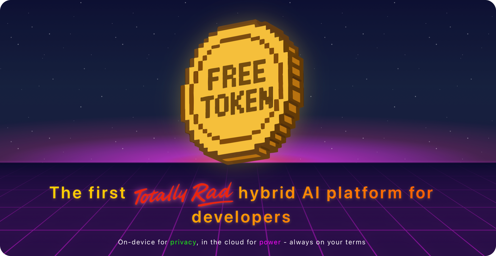

# FreeToken - The First Hybrid AI Platform for Developers

**On-device for privacy, in the cloud for power - always on your terms.**

FreeToken is the first hybrid AI developer platform that seamlessly combines on-device and cloud-based AI in one SDK. Build smarter applications with the flexibility to run AI locally for data privacy or leverage powerful cloud models like DeepSeek R1, Kimi K2, and GPT OSS 120B when you need to scale.

( **One API. Multiple deployment options. Total control.**

= [Get Started Free](https://console.freetoken.ai) | =Ú [Documentation](https://docs.freetoken.ai) | < [Website](https://freetoken.ai)