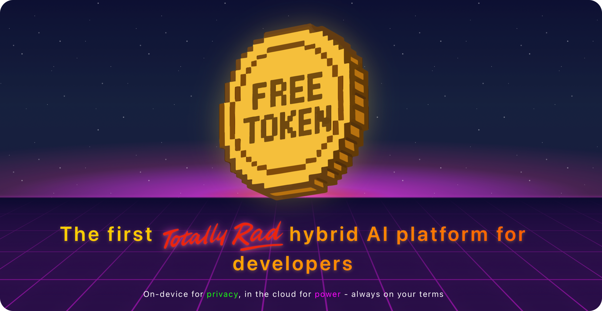

# FreeToken - The First Hybrid AI Platform for Developers

**On-device for privacy, in the cloud for power - always on your terms.**

FreeToken is the first _totally rad_ hybrid AI developer platform that seamlessly combines on-device and cloud-based AI in one SDK. Build smarter applications with the flexibility to run AI locally for data privacy or leverage powerful cloud models like DeepSeek R1, Kimi K2, and GPT OSS 120B when you need to scale.

**🧭 Start exploring today**

**[Kitchen Sink](https://github.com/FreeTokenAI/KitchenSinkSwift)**
Explore all the features and learn what you can build with the FreeToken SDK in one app. The Kitchen Sink app showcases on-device and cloud AI capabilities.

**[Swift SDK](https://github.com/FreeTokenAI/FreeTokenSwift)**
Begin building your own AI-powered iOS applications with our Swift SDK. The SDK provides easy access to both on-device and cloud AI models.

✅ [Get Started Free](https://console.freetoken.ai) | 🔍 [Documentation](https://docs.freetoken.ai) | 🌎 [Website](https://freetoken.ai)